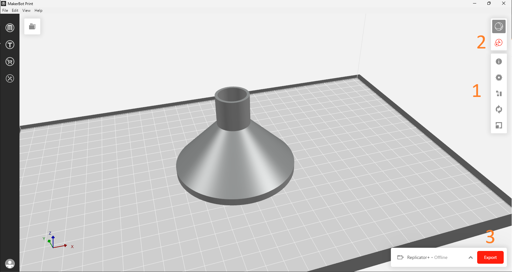
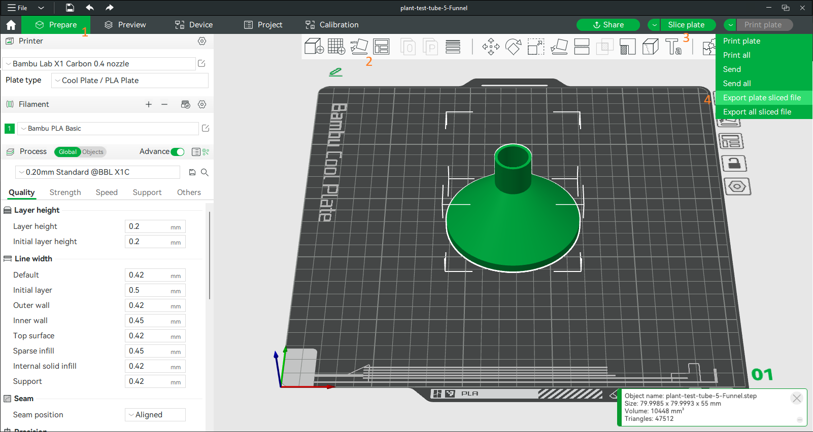

# community-knowledge base

A knowledge base compiled of previous projects and expertise from club members. 🌱

# Python 101

## Online Resources

First, check out [Python for Beginners](https://www.youtube.com/playlist?list=PLlrxD0HtieHhS8VzuMCfQD4uJ9yne1mE6) on YouTube.
This YouTube series will walk you from setting up your computer to basic skills that you will need.
If you prefer not to install anything into your computer, you can try using online IDE [here](https://www.programiz.com/python-programming/online-compiler/).
There is a [Python tutorial](https://www.programiz.com/python-programming/guide) from the same website too.
This tutorial will go deeper than the YouTube playlist.
But both of them will cover all mandatory topics to start coding with Python.

### For Purdue students

You can enroll in [Every Boilermaker Engineer Codes (EBEC)](https://engineering.purdue.edu/Engr/Academics/Undergraduate/ebec).
It is a free synchronize Python course.
Each week, you will get access to lectures via BrightSpace.
There will be quiz and coding exercises as assignments.
You don't need to go to the class at all.
But you can walk-in to in-version helping sessions which the instructors and TAs will help you on your assignments.
You can also choose to join virtual office hours that available approximately 10 sessions per week.
If you earn 70% or more points, you will get a digital certificate signed by Collage of Engineering.

# 3D Printing

This tutorial won't cover how to use CAD software to make 3D models.
There are plenty of CAD software options to choose and tutorial documents from the software creators, as well as YouTube tutorials.

## CAD Software

### FreeCAD

[FreeCAD](https://www.freecad.org/) is an open-source parametric CAD.
It is free to use and have extensive functions for engineering design including 3D modeling.
There are many [addons](https://wiki.freecad.org/Category:Addons) for specific functionalities and supports Python script for automation.
FreeCAD is [available](https://www.freecad.org/downloads.php) for all PC platforms: Windows, Mac, and Linux.

### Autodesk Fusion

Autodesk [Fusion](https://www.autodesk.com/products/fusion-360) is known for user-friendly.
Although it is not free to use, students have an [educational access](https://www.autodesk.com/education/edu-software/overview?sorting=featured&filters=individual) as long as you are a student.
It is available on Windows, Mac, and web-based.

### Other options

[SolidWork](https://www.solidworks.com/) and [Catia](https://www.3ds.com/products/catia) are both commonly used in industry.
However, the cost is quite expensive.
[Blender](https://www.blender.org/) is another open-source option for making 3D models.

## Export 3D model

Regardless of software you use to create 3D models, you will need to export your models to the slicer software.
The slicer's job is to breakdown your models into layers that represent how 3D printer will make your model in reality.
Each 3D printer will come with its slicer software.

## MakerBot

[MakerBot Print](https://www.makerbot.com/makerbot-print/) is a slicer program for printers from MakerBot.
It is available for Windows and Mac.
However, Mac version only supports 2 file types.

<blockquote>
    SUPPORTED FILE TYPES:

    Mac: MakerBot (.makerbot), STL (.stl)

    Windows: MakerBot (.makerbot), STL (.stl), SolidWorks (.sldprt, .sldasm), InventorOBJ (.ipt, .iam), IGES (.iges, .igs), STEP AP203/214 (.step, .stp), CATIA (.CATPart, .CATProduct), Wavefront Object(.obj), Unigraphics/NX (.prt), Solid Edge (.par, .asm), ProE/Creo (.prt, .prt., .asm, .asm.), VRML(.wrl), Parasolid (.x_t, .x_b)

</blockquote>

After import model(s) to MakerBot Print, do following steps:

1. Adjust printing setting (usually leave it as default), orientation, and location
2. Run print preview. This step could take a couple minutes depending on model complexity.
3. Export the file to a thumb drive.

## Bambu Lab

[Bambu Studio ](https://bambulab.com/en/download/studio) is the slicer program for Bambu Lab's printers.
It is available for Windows and Mac with installers.
For Linux user, you can download the software from Bambu lab's Github.
Bambu studio supports the popular file format like STL but it is recommend to use STEP file extension.

1. Click on the `Prepare` tab then drag the file(s) you want to print.
2. Adjust the position. Bambu studio has an automatic adjustment function for this job.
3. Slice the model(s).
4. Export the file to an SD card.
